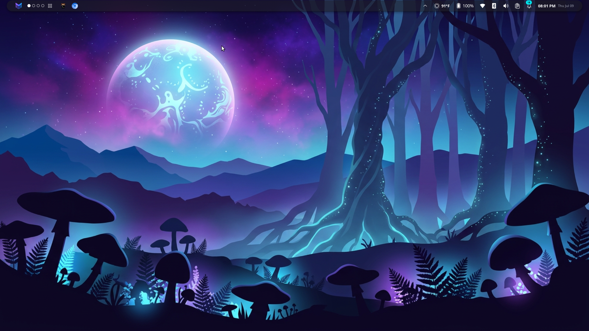
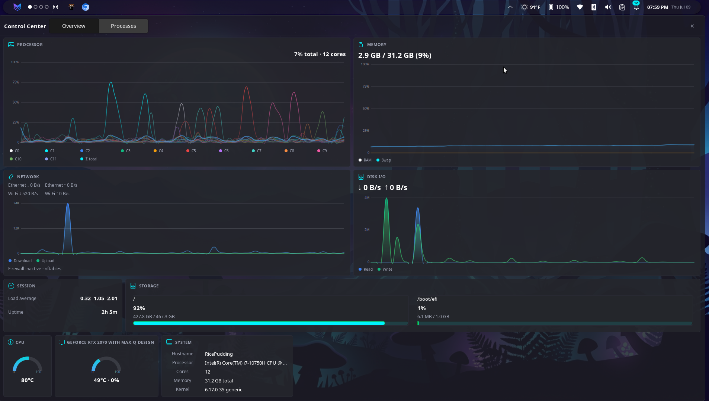
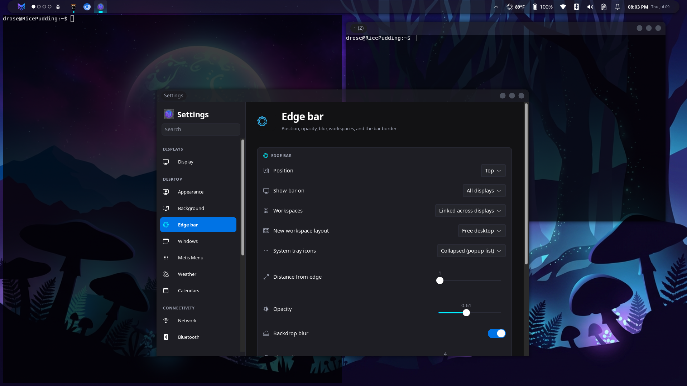

# Metis

> **Beta** — Metis is under active development. Expect rough edges: session setup,
> window management, and configuration formats may change between releases. Bug
> reports and feedback are welcome.

> **Metis** is a next-generation Wayland desktop environment built in Rust. The
> **Metis compositor** owns the Wayland session, the window grid, and the
> wallpaper; the **Metis shell** is a GTK4 layer-shell edge bar (plus on-demand
> popovers) spawned by the compositor.

New to Metis? Start with the **[User Guide](docs/USER_GUIDE.md)**.

## Screenshots

**Desktop** — edge bar, workspaces, weather, and server-side window decorations on a
theme-aware wallpaper.



**Control Center** — pull-down system monitor with live charts and a searchable process
list (Settings → Control Center to configure).



**Settings** — grouped sidebar for display, appearance, connectivity, input, gaming,
and system configuration.



## Philosophy

- **Performance first** — idiomatic, low-overhead Rust with `tokio` async and damage-driven rendering.
- **Compositor-first** — a Smithay compositor owns the session; the shell is spawned by it.
- **On-demand shell** — `wlr-layer-shell` overlays (edge bar, app launcher, popovers) summoned when needed and torn down cleanly.

## Workspace layout

```
.
├── metis-os-workspace/          # Cargo workspace
│   ├── assets/                  # Wallpapers, portal registration, session launcher
│   ├── metis-capture/           # Shared Wayland ext-image-copy-capture client (shell + portal)
│   ├── metis-compositor/        # Smithay Wayland compositor (winit nested backend for dev)
│   ├── metis-config/            # Shared config + theme-token types (serde, no GTK)
│   ├── metis-gaming/            # Flatpak optimizer, health checks, metis-gamingd daemon
│   ├── metis-grid/              # Window grid / tiling + scrolling layout engine (pure logic)
│   ├── metis-portal/            # xdg-desktop-portal backend (Settings, Screenshot, ScreenCast)
│   ├── metis-protocol/          # Shared JSON IPC contracts between compositor and shell
│   ├── metis-remote/            # Desktop sharing orchestrator (gnome-remote-desktop RDP)
│   ├── metis-secrets/           # Shared freedesktop Secret Service (oo7) wrapper
│   ├── metis-settings/          # GTK4 control center (appearance, devices, system)
│   ├── metis-shell/             # Metis shell — GTK4 layer-shell edge bar + popovers
│   └── scripts/                 # Dev / packaging helper scripts
├── Screenshots/                 # README showcase images
└── docs/                        # User guide + development setup
```

## Technology stack

- **Language:** Rust (stable), `tokio` async, `serde`/`serde_json` for JSON contracts.
- **Compositor:** [Smithay](https://github.com/Smithay/smithay) with a `winit` nested backend for development; `calloop` event loop; `image` for wallpaper decode; XWayland for X11 apps.
- **Shell / UI:** GTK4 with [`gtk4-layer-shell`](https://github.com/wmww/gtk4-layer-shell); `zbus` for the freedesktop notification daemon.
- **IPC:** JSON over Unix sockets (`metis-protocol`) plus a runtime command file under `$XDG_RUNTIME_DIR/metis/`.
- **Configuration:** JSON under `~/.config/metis/`.

## Quick start

See [`docs/UBUNTU_DEV.md`](docs/UBUNTU_DEV.md) for full system-package setup (Ubuntu 24.04+).

```bash
# Install GTK4 + layer-shell dev packages (Ubuntu example)
sudo apt install -y build-essential pkg-config libssl-dev \
  libgtk-4-dev libadwaita-1-dev libgtk-4-layer-shell-dev

# Build and launch a nested dev session
cd metis-os-workspace/metis-shell
./run-metis.sh --build --session
```

The nested session runs inside your existing Wayland session via the winit
backend. Session mode disables the wallpaper and login briefing by default;
re-enable them with:

```bash
METIS_NO_WALLPAPER= METIS_NO_BRIEFING= ./run-metis.sh --session
```

To simulate multiple monitors in the dev session, split the window into N
side-by-side virtual outputs:

```bash
METIS_VIRTUAL_OUTPUTS=2 ./run-metis.sh --session
```

### Standalone session (real TTY/GPU)

Metis also runs as a real desktop session on its own GPU via a DRM/KMS + libseat
+ libinput backend (autodetected when no parent Wayland/X11 session is present).
Install the login entry and pick **Metis** from your display manager, just like
Hyprland:

```bash
./run-metis.sh --install-session   # build release + install the session entry
```

Or test it directly from a free VT with `./run-metis.sh --session --drm`. See
[`docs/UBUNTU_DEV.md`](docs/UBUNTU_DEV.md) for details and escape hatches
(Ctrl+Alt+Backspace to quit, Ctrl+Alt+F<n> to switch VT).

## Using Metis

Full walkthrough in the **[User Guide](docs/USER_GUIDE.md)**. The essentials:

- **Edge bar** — app launcher, taskbar dock, workspaces, weather, battery,
  Bluetooth (when an adapter is present), network, volume, notifications, and a
  tabbed clock. Right-click dock icons to pin/close.
- **Control Center** — pull the edge bar toward the desktop (or click the grid
  icon beside the workspace dots) for a system monitor: CPU/memory/network/disk
  charts, temperature gauges, and a searchable process list with right-click
  actions. Configure in Settings → Control Center.
- **Windows** — every app gets a server-side titlebar with close / minimize /
  maximize. Drag the titlebar to move; drag to a screen edge to snap
  (half / quarter / maximize); drag a border to resize. On the default desktop
  layout, windows reopen at the position and size you last left them.
- **Workspaces** — `Super`+`1`..`9` switch, `Super`+`Shift`+`1`..`9` move the
  focused window, `Super`+`Alt`+`←`/`→` cycle workspaces (wraps). Each monitor
  has its own workspaces (configurable).
- **Cross-output moves** — drag a window onto another monitor (or snap it there)
  and it follows that display's desk; on grid workspaces `Super`+`Shift`+`←`/`→`
  sends the focused window to the adjacent monitor.
- **Scrolling layout** — toggle any workspace into a niri/PaperWM-style scrolling
  strip with `Super`+`\`; navigate with `Super`+arrows.
- **Settings** — launch from the app launcher, or `metis-cmd settings`. Grouped
  sidebar (Displays, Desktop, Connectivity, Input, System) with search. Pages
  include Display, Appearance, Metis Menu, Weather, Network, Calendars,
  Input, Bluetooth, Printers, Power, Sound, **Gaming**, and **Control Center**.
- **Gaming** — hybrid-GPU routing (`gaming.json`), Flatpak Steam/Lutris/Heroic
  overrides, health checklist, and `metis-gamingd` for auto performance profile
  + GameMode while gaming. See the [User Guide — Steam & Proton](docs/USER_GUIDE.md#steam-proton--steamos-class-gaming).
- **Screenshots** — **PrtSc** opens a native Metis overlay (Selection / Full screen /
  Window); **Shift+PrtSc** captures the full screen instantly; **Ctrl+PrtSc** starts in
  Window mode. **Esc** dismisses without capturing. Third-party apps (Flameshot, etc.)
  still use the xdg-desktop-portal Screenshot interface via `metis-portal`.
- **Notification Center** — click the clock for a right-side panel (notifications,
  calendar events, world clocks / timer / alarms). Toasts appear top-right with a
  close button.

| Shortcut | Action |
|----------|--------|
| `PrtSc` | Interactive screenshot overlay |
| `Shift`+`PrtSc` | Instant full-screen capture (no overlay) |
| `Ctrl`+`PrtSc` | Screenshot overlay starting in Window mode |
| `Esc` | (screenshot overlay) Dismiss without capturing |
| `Super`+`1`..`9` | Switch workspace (on the monitor under the pointer) |
| `Super`+`Shift`+`1`..`9` | Move focused window to a workspace |
| `Super`+`Alt`+`←` / `→` | Cycle to previous / next workspace (wraps at 1..=count) |
| `Super`+`Shift`+`←` / `→` | (grid) Move focused window to adjacent monitor |
| `Super`+`Ctrl`+`Shift`+`←` / `→` | Move active workspace to adjacent monitor (independent mode) |
| `Super`+`F` | Toggle maximize for the focused window (below the edge bar) |
| `Super`+`Q` | Close the focused window |
| `Esc` | Exit fullscreen / immersive (focused window) |
| `Super`+`\` | Toggle the active workspace between grid and scrolling |
| `Super`+arrows | (scrolling) Move focus across columns / within a stack |
| `Super`+`Shift`+arrows | (scrolling) Move the column / window |
| `Super`+`,` / `Super`+`.` | (scrolling) Consume into / expel from a column |
| `Super`+`-` / `Super`+`=` | (scrolling) Cycle the focused column width |

## Configuration

Configuration lives in `~/.config/metis/`. On first run the shell writes these
defaults:

| File | Purpose |
|------|---------|
| `bar.json` | Edge bar position/size/opacity/blur, widget order, workspaces, window/titlebar borders, default layout |
| `clock.json` | World clocks and alarms |
| `calendars.json` | Calendar accounts (local / CalDAV / Thunderbird / Microsoft 365) |
| `themes/dark.json`, `themes/light.json` | Design tokens — accents, semantic status colors, `text_on_accent`, shadows/glows |

Other files are created on demand:

| File | Created when | Purpose |
|------|--------------|---------|
| `config.json` | You change a preference | Active theme, onboarding state, briefing-on-login |
| `menu.json` | You set launcher defaults / pins | App launcher: terminal + file-manager choices, pinned apps |
| `wallpaper.json` | You pick a background | Wallpaper picture / colour / gradient (+ per-output overrides) |
| `weather.json` | You configure weather | Bar weather: unit, auto-detect / IP-geolocation, saved locations |
| `desk.json` | The compositor persists its layout | Compositor window-grid layout (widget tiles) |
| `dismissed.json` | You dismiss a calendar reminder | Dismissed reminder IDs |
| `briefing.json` | You create it (optional) | Login-briefing weather coordinates + RSS feed |
| `input.json` | You configure input devices | Mouse, touchpad, keyboard (compositor live-reload) |
| `power.json` | You configure power settings | Power profile (`powerprofilesctl`), idle blank/suspend, lid-close |
| `dashboard.json` | You configure Control Center | Enable, widget order, max height %, refresh interval, confirm-before-kill |
| `gaming.json` | You configure gaming | Graphics mode, auto performance/GameMode, Flatpak GPU env |
| `gaming-flatpak.json` | Gaming setup runs | Record of applied Flatpak gaming overrides |
| `screenshot.json` | You configure screenshots | Default mode, pointer toggle, delay, after-capture, save dir |
| `outputs.json` | You configure displays | Per-output scale, resolution/refresh, layout, `display_mode` / `mirror_source`, night-light prefs |

Edit `bar.json` or `themes/*.json` while the shell runs — bar changes apply
within ~1s and theme edits re-apply live. Set `opacity` < 1 for a see-through
bar and `blur: true` (with an optional `blur_radius`, default 18) for a
compositor Gaussian backdrop blur. See the
[User Guide](docs/USER_GUIDE.md#10-configuration-reference) for the full field
reference.

## Status

- **Phase 1 — Edge bar:** complete. App launcher, tabbed clock, grouped
  notifications (freedesktop D-Bus daemon), Wi-Fi/volume popovers, weather, and
  fully token-driven theming with live reload, transparency, and backdrop blur.
- **Phase 2 — Settings app + window decorations:** complete. A standalone
  `metis-settings` app (Appearance, Metis Menu, Weather, Network, Calendars),
  compositor-drawn server-side titlebars/borders, edge snapping, auto-hide
  titlebars, and first-class XWayland windows (Metis titlebar, placement,
  move/resize/snap, dock/IPC). Electron/Chromium apps are steered onto native
  Wayland for stability.
- **Phase 3 — Multi-monitor, workspaces & tiling:** largely complete. Per-output
  edge bars, wallpaper, and usable areas; independent or linked per-output
  workspaces; a taskbar dock that follows the output + workspace; and an optional
  niri/PaperWM-style scrolling layout selectable per workspace.
- **Phase 4 — System settings expansion:** complete for the planned Device +
  System pages (Input, Bluetooth, Printers, Power, Sound, Display). Bluetooth
  battery/charging in the bar and Power settings; optional Solaar integration
  for Logitech peripherals.
- **Portal capture (Screenshot):** `metis-portal` serves
  `org.freedesktop.impl.portal.Screenshot` via native `ext-image-copy-capture`
  (compositor-side protocol + portal Wayland client). Verified with Flameshot
  and other xdg-desktop-portal screenshot apps. ScreenCast PipeWire streaming works
  (SHM frame pump; dmabuf zero-copy deferred).
- **Phase 12 — Native Screenshot Tool:** **complete** (2026-07-09) — PrtSc overlay
  (Selection / Screen / Window), theme-aware toolbar, `metis-capture` crate,
  clipboard/save/viewer, compositor keybinds, and `screenshot.json` defaults.
- **Phase 13 — Notification Center:** **complete** (2026-07-10) — right-edge panel
  from the clock (bell merged), collapsible notification/events cards, calendar
  tool rail, closable toasts, theme-aware `metis-nc-*` CSS.
- **Phase 5 — display pipeline (VRR / colour / HDR):** in progress — Settings →
  Display now supports resolution/refresh, multi-monitor arrangement, and
  duplicate (mirror) mode on DRM sessions; VRR, night-light compositor, and HDR
  remain upcoming.
- **Phase 6 — Flatpak, Steam & gaming (v1):** **complete** (2026-07-05) — idle-inhibit
  portal, ScreenCast PipeWire pump (SHM; dmabuf zero-copy deferred), Flatpak launcher
  integration, GPU steering + dGPU game offload, Proton verified on hardware,
  Background + PowerProfileMonitor portal stubs, `wl_touch`, Settings → Gaming page,
  and full permission/override docs.
- **Phase 10 — Control Center:** **complete** (2026-07-07; process tree + monitor
  picker 2026-07-11) — pull-down system monitor; Overview charts; Processes tab
  with PPID tree, search, and End task / End process tree; Settings → Control
  Center (including process monitor picker); `dashboard.json` live reload.
- **Configurable shortcuts:** Settings → Keyboard → Shortcuts + `keybinds.json`
  (2026-07-11) — capture/edit compositor binds; reserved DRM VT/quit chords locked.
- **Phase 11 — Gaming Platform 2.0:** **complete** (2026-07-07) — `gaming.json` +
  `metis-gaming` crate, Flatpak zero-config optimizer, health checklist + setup wizard,
  `metis-gamingd` (auto performance profile / GameMode), hybrid PRIME scanout polish,
  and `metis-cmd reload-gaming` / `optimize-gaming`.

Optional follow-up: dmabuf screencast perf, Deck-class hardware verification,
compositor **dim on battery** hook.

See [`metis-os-workspace/TODO.md`](metis-os-workspace/TODO.md) for the detailed
roadmap, [`CHANGELOG.md`](CHANGELOG.md) for recent changes, and
[`docs/PERF_AUDIT.md`](docs/PERF_AUDIT.md) for performance and binary-size notes.

## License

Licensed under the [MIT License](LICENSE).
